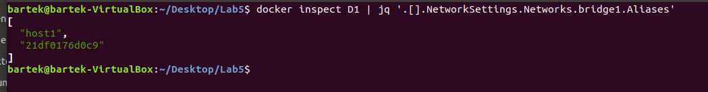
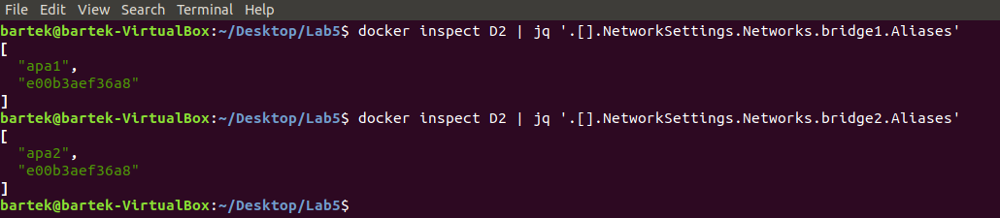
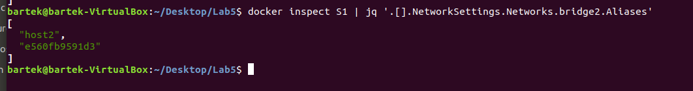

# Sprawozdanie z przedmiotu "Programowanie w chmurze obliczeniowej" - Lab. Network
W sprawozdaniu zostały wykonane wszystkie ćwiczenia obwiązkowe. 

>link Github: https://github.com/Bartistero/-Network-Lab                            

## Tabela zawartości
* [Zadanie 5Z1](#Zadanie-1,2)
* [Zadanie 5Z2](#zadanie-3)
* [Status](#status)
* [Kontakt](#contact)

## Zadanie 5Z1
Podczas wykonywania tego został wykonany skrypt `skrypt.sh`, który znajduje się w repozytorium. 

## Zadanie 5Z2

Podczas wykonywania tego został wykonany skrypt `skrypt2.sh`, który znajduje się w repozytorium. 

W celu sprawdzenia nadania aliasu należy wywołać komende `Docker inspect`, a przy użyciu potoków, wykorzystać program jq w celu szybszego wydobycia interesującej informacji. 

# Kontener D1:
> `docker inspect D1 | jq '.[].NetworkSettings.Networks.bridge1.Aliases`
> 

# Kontener D2: 

>`docker inspect D2 | jq '.[].NetworkSettings.Networks.bridge1.Aliases'`

Oraz 

>`docker inspect D2 | jq '.[].NetworkSettings.Networks.bridge2.Aliases'`

# Kontener S1 

>`docker inspect S1 | jq '.[].NetworkSettings.Networks.bridge2.Aliases'`

## Status
Project is: finished

## Kontakt
Created by [@Bartistero](https://github.com/Bartistero/) - feel free to contact me!
